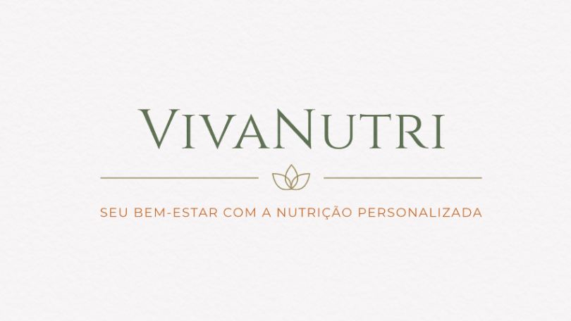

## 👋 Oi! Eu sou Raquel Martins
🎓  Desenvolvedora dedicada a aprender e resolver problemas reais com soluções práticas.

🌱 Busco novas tecnologias para aprimorar habilidades e entregar resultados reais.

💻 Gosto de criar aplicações que façam a diferença no dia a dia das pessoas.

## 🚀 Tecnologias e Ferramentas que eu uso:

  
  
  
  
  
  
  
  
  

## ⭐ Meus Projetos em Destaque

<table align="center">
<tr align="center">
<td>
<a href="https://viva-nutri.vercel.app">

 
<b>VivaNutri</b>
</a>
 

Plataforma de apoio nutricional com registro de refeições, avaliações e acompanhamento de progresso. Feita com React.

</td>
<td>
<a href="https://medi-care-front-end.vercel.app">

 
<b>MediCare</b>
</a>
 

Controle de Estoque de Medicamento. Tecnologias usadas: React, C#, PostgreSQL

</td>
</tr>
</table>

##  📈 Minhas Estatísticas:

 <a href="https://github.com/Raquel212">   

## 🌐 Vamos nos conectar?

    

  
 
 

